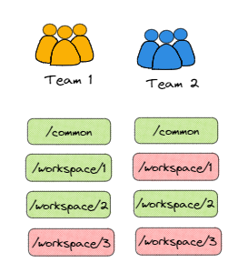

# Authn & Authz using OPA & Envoy Part 2

## Introduction

So in [part 1](./opa-envoy.md) we introduced what we're doing, created our app registrations within Azure AD and retrieved our token, now we'll look to continue with our PoC & test it out.

## Implement

I'm probably about to present the scenario in the worst possible way...<br/>
But what we want is for the teams to authenticate using their respective tokens.<br/>
What the teams have access to is determined by our team role, so the roles and endpoints shown in the diag below is what we will look to create.

Note: Green is permit, red is deny..




### API

In our [repo here](https://github.com/podedra92/opa-envoy), we have a dir called dummy-api, its a quick and nasty Fast API which has a couple of endpoints.

`dummy-api/main.py:`
```python
@app.get("/common")
def common():
    return {"message": "common"}

@app.get("/workspaces/{id}")
def namespace(id):
    return {"message": f"You have access to workspace {id}"}

@app.get('/health')
def health():
    return 'health'
```

If I were to call `/common` endpoint, I'd get the response `{"message": "common"}`.<br/>
If I call `/workspaces/1` I would get the response `{"message": "You have access to workspace 1"}`.

In our Dockerfile, we are just copying and running our app, on port 8080.

`dummy-api/Dockerfile:`
```docker
FROM python:slim

RUN pip install fastapi \
pip install uvicorn

WORKDIR /app

COPY dummy-api/main.py /app

CMD ["uvicorn", "main:app", "--host", "0.0.0.0", "--port", "8080"]
```

Finally we define our pod in our docker-compose, and add a port-forward so we can test it out:

`docker-compose.yml`

```yaml
services:
  dummy-api:
    image: dummy-api
    build:
      context: .
      dockerfile: dummy-api/Dockerfile
    ports:
      - "8080:8080"
```

If we run `docker-compose up` the pod should run and be exposed on port 8080

Lets try a get request to our workspaces endpoint: `http://localhost:8080/workspaces/1`

```json
{
    "message": "You have access to workspace 1"
}
```

### Envoy

Ok so lets add in our AuthN, remember we're using Envoy here to handle this, it will act as a proxy for our service and should validate this token against Azure AD.<br/>

We'll need to put our yaml engineering hats on for this....


We'll want to configure some `static_resources` specifically `listeners` & `clusters`


`envoy/config.yaml:`

```yaml
static_resources:
  listeners:
  - address:
      socket_address:
        address: 0.0.0.0
        port_value: 8000
```

Here we're simply declaring that we're listening on port 8000, next we'll add a filter so we can specify a route and decide what to do once that route has been matched.<br/>

`envoy/config.yaml:`

```yaml
    filter_chains:
    - filters:
      - name: envoy.filters.network.http_connection_manager
        typed_config:
          "@type": type.googleapis.com/envoy.extensions.filters.network.http_connection_manager.v3.HttpConnectionManager
          codec_type: auto
          stat_prefix: ingress_http
          route_config:
            name: local_route
            virtual_hosts:
            - name: backend
              domains:
              - ["*"]
              routes:
              - match:
                  prefix: "/"
                route:
                  cluster: service
          http_filters:
          - name: envoy.filters.http.jwt_authn
            typed_config:
              "@type": type.googleapis.com/envoy.extensions.filters.http.jwt_authn.v3.JwtAuthentication
              providers:
                provider_azad:
                  issuer: https://login.microsoftonline.com/<TenantID>/v2.0
                  audiences: <ClientID>
                  forward: true
                  remote_jwks:
                    http_uri:
                      uri: "https://login.microsoftonline.com/<TenantID>/discovery/v2.0/keys"
                      cluster: azad
                      timeout: 10s
                    cache_duration: 
                      seconds: 600
              rules:
              - match:
                  prefix: /health
              - match:
                  prefix: /common
                requires:
                  provider_and_audiences:
                    provider_name: provider_azad
                    audiences:
                      <ClientID>
              - match:
                  prefix: /workspaces
                requires:
                  provider_and_audiences:
                    provider_name: provider_azad
                    audiences:
                      <ClientID>
```

So we've done quite a bit here...<br/>
We're specifying that we want to match all domains `[*]` with routes `/` and we want to route it to a cluster named ***service***.<br/>
On top of this we've added a http_filter which will carry out our authn, this will be routed to our `azad` cluster.<br/>
In the filter we provide the tenant id and aud of our **my-demo-app** app registration.

We've also added in some rules to match against, now I could probably do this better, like incorporate regex, but I didn't quite get that working, so all we're specifying is `/common` and `/workspaces` require token validating.<br/>
My health endpoint however does not have `provider_and_audiences` defined, thus allows for unauthenticated requests.

Under the `http_filters:` we'll also add our authz filter.

`envoy/config.yaml:`

```yaml
          - name: envoy.ext_authz
            typed_config:
              "@type": type.googleapis.com/envoy.extensions.filters.http.ext_authz.v3.ExtAuthz
              transport_api_version: V3
              with_request_body:
                max_request_bytes: 8192
                allow_partial_message: true
              failure_mode_allow: false
              grpc_service:
                google_grpc:
                  target_uri: opa:9191
                  stat_prefix: ext_authz
```

Key thing to note here is our target uri which is opa, and the `plugins.envoy_ext_authz_grpc.addr` we supply to our OPA pod, Im going to use `9191`, we'll need to specify set this in our docker-compose later when we setup OPA.

Note there is a `envoy.filters.http.router` which just propagates requests to correct cluster.

Now we declare our clusters, `service` and `azad` respectively.
Both of these require an address and port number, in the case of our dummy-api its the service name we specified in our docker-compose.<br/>
For azad cluster it will be the Azure AD login page `login.microsoftonline.com`.

`envoy/config.yaml:`

```yaml
  clusters:
  - name: service
    connect_timeout: 0.25s
    type: strict_dns
    lb_policy: round_robin
    load_assignment:
      cluster_name: service
      endpoints:
      - lb_endpoints:
        - endpoint:
            address:
              socket_address:
                address: dummy-api
                port_value: 8080
  - name: azad
    connect_timeout: 100s
    type: strict_dns
    lb_policy: round_robin
    load_assignment:
      cluster_name: azad
      endpoints:
      - lb_endpoints:
        - endpoint:
            address:
              socket_address:
                address: login.microsoftonline.com
                port_value: 443
    transport_socket:
      name: envoy.transport_sockets.tls
      typed_config:
        "@type": type.googleapis.com/envoy.extensions.transport_sockets.tls.v3.UpstreamTlsContext
        sni: login.microsoftonline.com
```

Now under services we're going to add our envoy services, mounting the config.yaml file and port-forwarding to the listeners.

`docker-compose.yml`

```yaml
  envoy:
   image: envoyproxy/envoy:v1.23-latest
   volumes:
     - ./envoy/config.yaml:/etc/envoy/envoy.yaml
   ports:
   - "5200:8000"
   - "5201:8001"
```

### OPA

Ok for OPA all we need is a simple policy.rego file, remember example is in the [repo](https://github.com/podedra92/opa-envoy).


So I'm going to just paste in th rego with inline comments, as hopefully its self explanatory

```go
package envoy.authz

# Importing required modules
import input.attributes.request.http as http_request
import input.parsed_path

# Default deny policy
default allow = false

# Rule to allow GET requests to path starting with "health"
allow {
    parsed_path[0] == "health"
    http_request.method == "GET"
}

# Rule to allow GET requests to path starting with "common"
allow {
    parsed_path[0] == "common"
    http_request.method == "GET"
}

# Rule to check required roles for accessing resource
allow {
    required_roles[r]
}

# Rule to define required roles for accessing resource
required_roles[r] {
    perm := role_perms[claims.roles[r]][_]
    perm.method = http_request.method
    perm.path = http_request.path
}

# Decoding JWT bearer token and extracting claims
claims := payload {
    [_, payload, _] := io.jwt.decode(bearer_token)
}

# Extracting JWT bearer token from authorization header
bearer_token := t {
    v := http_request.headers.authorization
    startswith(v, "Bearer ")
    t := substring(v, count("Bearer "), -1)
}

# Mapping of roles to permissions
role_perms = {
    "team1": [
        {"method": "GET",  "path": "/workspaces/1"},
        {"method": "GET",  "path": "/workspaces/2"},
    ],
    "team2": [
        {"method": "GET",  "path": "/workspaces/2"},
    ],
}
```

Now under services we're going to add our OPA service, mounting the rego file and remembering to set our `plugins.envoy_ext_authz_grpc.addr to 9191`.

`docker-compose.yml`

```yaml
  opa:
   image: openpolicyagent/opa:latest-envoy
   volumes:
     - ./opa/policy.rego:/etc/policy.rego
   command:
     - run
     - --server
     - --log-level=debug
     - --log-format=json-pretty
     - --set=plugins.envoy_ext_authz_grpc.addr=:9191
     - --set=decision_logs.console=true
     - --set=plugins.envoy_ext_authz_grpc.path=envoy/authz/allow
     - /etc/policy.rego
```

## Test

With all our services defined and policies in place, I'm just going run `docker-compose up`

We should see our pods running, now lets do a GET request to `http://localhost:5200/common`

```sh
# REQ:
curl http://localhost:5200/common

# RESP:
401 Unauthorized
Jwt is missing
```

Good so as expected when there isn't a token provided envoy will return a 401.

### Token time

Lets retrieve our token for Team 1 and add that in our request:

```sh
# REQ:
curl http://localhost:5200/common -H "Authorization: Bearer eyJ0eXAiOi..."

# RESP:
200
{
    "message": "common"
}
```

Now lets try access workspace 1 & 2:


```sh
# REQ:
curl http://localhost:5200/workspaces/1 -H "Authorization: Bearer eyJ0eXAiOi..."

# RESP:
200
{
    "message": "You have access to workspace 1"
}
```
```sh
# REQ:
curl http://localhost:5200/workspaces/2 -H "Authorization: Bearer eyJ0eXAiOi..."

# RESP:
200
{
    "message": "You have access to workspace 2"
}
```

All good so far... Workspace 3? 

```sh
# REQ:
curl http://localhost:5200/workspaces/3 -H "Authorization: Bearer eyJ0eXAiOi..."

# RESP:
403
```


As expected Team 1 is forbidden from accessing workspace 3!

And carrying out the same validation for Team2 (remember to update the credentials when retrieving the token).

We should get 200 for `/common` and `/workspaces/2`, and a 403 for everything else.

## Conclusion

We've successfully implemented Authentication and Authorisation via a quick PoC using OPA and Envoy.<br/>
There are no doubt improvements to be made to both policies and envoy configuration, but hopefully this was a useful quick go to for getting started.
