# Authn & Authz using OPA & Envoy 

## Introduction

So I recently played with OPA & Envoy in-order to explore authentication (Authn) and authorization (Authz). 
In this blog, we'll look to quickly walk through the setup, and to accompany this post there is an example [opa-envoy repo found here](https://github.com/podedra92/opa-envoy).

Worth noting if you're using Open Service Mesh - they have a walkthrough for enabling the plugin, [ref doc](https://release-v1-2.docs.openservicemesh.io/docs/guides/integrations/external_auth_opa/#osm-with-opa-plugin-external-authorization-walkthrough).

**Note:** There are a tonne of other approaches to auth - so further posts will also probably follow.

### Authn & Authz

Lets cover the basics:

**Authn:** Verifies the identity of a user or system, I am who I say I am, e.g. credential based (username and password), certificate based etc.

**Authz:** Determines whether a user or a system is authorized to access a resource or perform an action.
This involves evaluating the permissions/entitlements granted to the user or the system, against a set of policies which specify what is allowed or denied.

### Why are we doing this?

We could embed this within our application, but really we want to try decouple the security concerns from business logic. 
SoC (separation of concerns) leads to easier updates and testing, having said this we still want to enable our various development teams by allowing them to write their own policies, but have it centrally managed.

### OPA

Open Policy Agent (OPA) if you aren't already aware is a well established CNCF graduate, having been accepted in 2018. 
Its an open source, versatile policy engine, providing a central and unified method for enforcing policies.

Rego is the declarative language used for defining fine-grained policies, its meant to be easy to read and write (perfect for me!). 
Once policies are authored and tested, they are consumed by OPA and used for evaluation.

### Envoy

Envoy is a proxy operating at L7 level, its the backbone for most service meshes, and fortunately for us supports External filters, such as an external authorization filter, this allows for delegation of decisions such as authorization to an external service.

This is where OPA and Envoy can be used in conjunction, OPA-Envoy plugin extends OPA with a gRPC server which implements Envoys External authz api (authorization filter).

## Implement

Lets have a look at what we're creating:

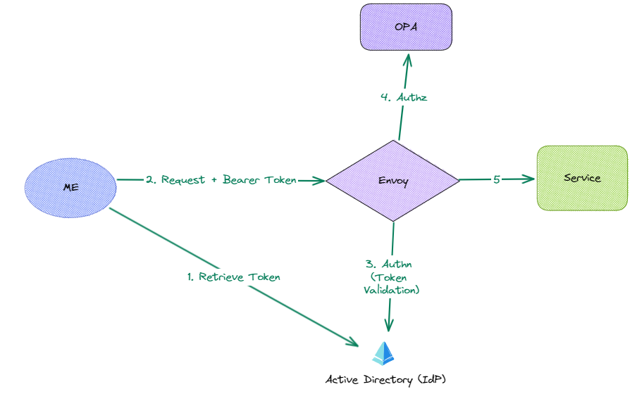

1. I'll use credentials to retrieve a token from Azure AD (Active Directory). 
1. The token retrieved in step 1 will then be passed, in the header of my request, to the api.
Envoy acting as a proxy will look to carry out the authn and authz filters.

1. Authn filter will validate the JWT, an invalid token will return a 401, a valid token will be forwarded on.
1. Envoy will then initiate the Authz filter, offloading the decision to OPA, the authorization service.  OPA will validate the role within the token against the policies defined and determine whether the action should be permitted or denied.
1. Envoy then forwards the request to the service or returns a 403 (forbidden).

::: tip Deploying
When not running locally, we'll probably want to deploy the services as sidecar containers.
:::

### Create App Registrations - Azure AD

**Note:** You can also use the same steps within Azure AD B2C.

1. Create an app registration - [see microsoft docs](https://learn.microsoft.com/en-us/azure/active-directory/develop/quickstart-register-app#register-an-application)

**Azure Active Directory > App registrations > + New Registration**

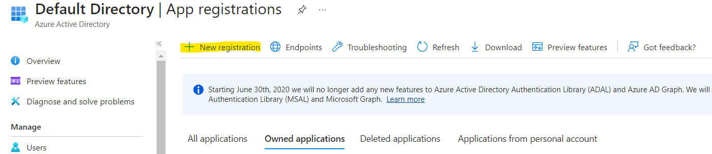

Select Register - don't set redirect URI

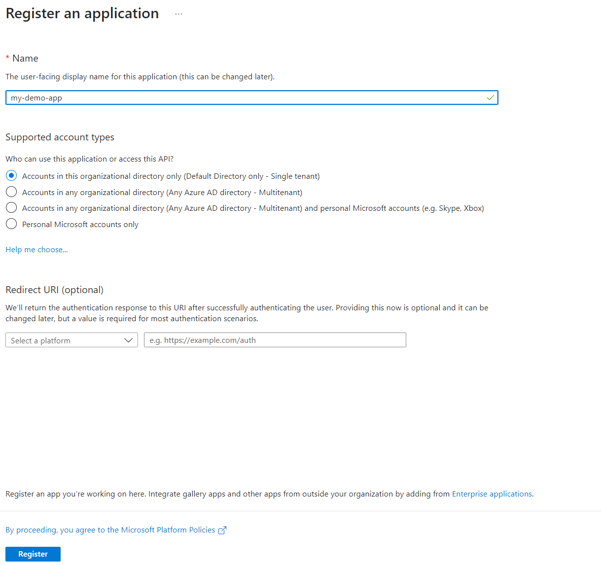

After registering:
1. Note the Application ID
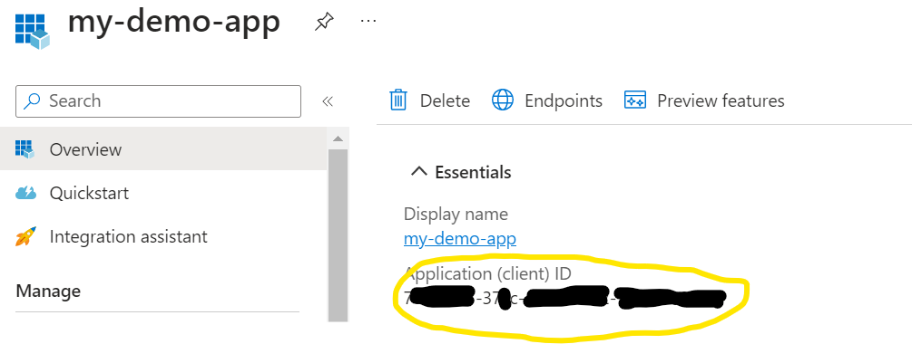

1. Add a client secret
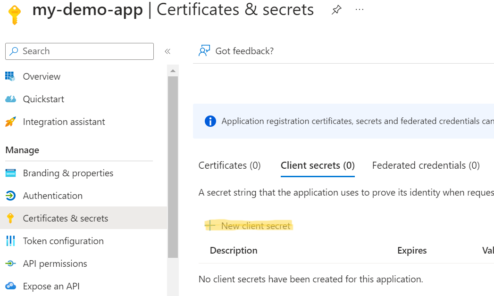

1. Enforce the use of the V2 OAuth endpoint - see this blog for more info [V1 & V2 Access tokens.](https://matthijs.hoekstraonline.net/2020/04/27/v1-and-v2-identity-and-access-tokens-with-azure-active-directory/)
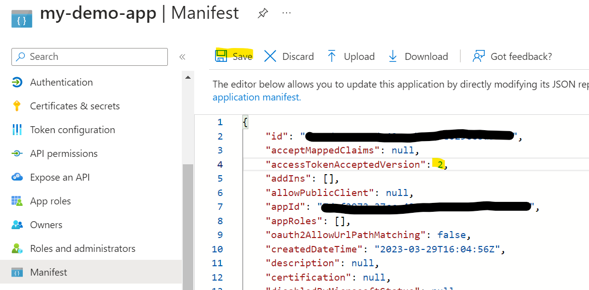

1. Set App ID URI

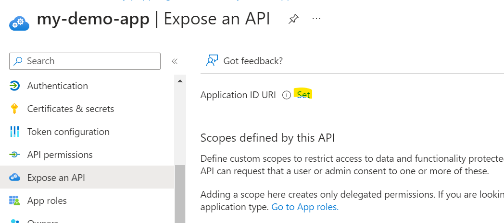

Now we want to create a few custom app roles, I'm going to create one role called team1, and a second role team2.

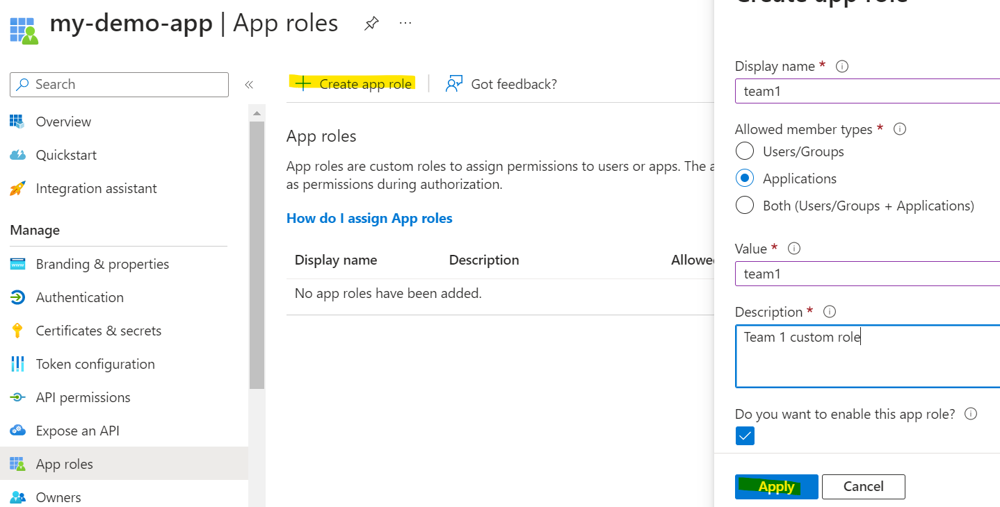

 

Ok so we've created our first app registration for the application, what we want to do now is create an app registration for each of our teams I'll name these apps **team-1** & **team-2**.
  
So we'll only need to repeat a couple of our steps from above:

1. Register a new app.
1. Add client secret to the app.

We now want to delegate an API permission from my **team-1** app registration to **my-demo-app** app registration, giving it the role, you guessed it, **team1**. 
We'll also do the same for my **team-2** app, why?  Well this will allow us to obtain a token, using the credentials from my **team-1** or **team-2** app registration, with the appropriate scope to **my-demo-app**.

1. Add the api permission for my-demo-app from my **team-1** app
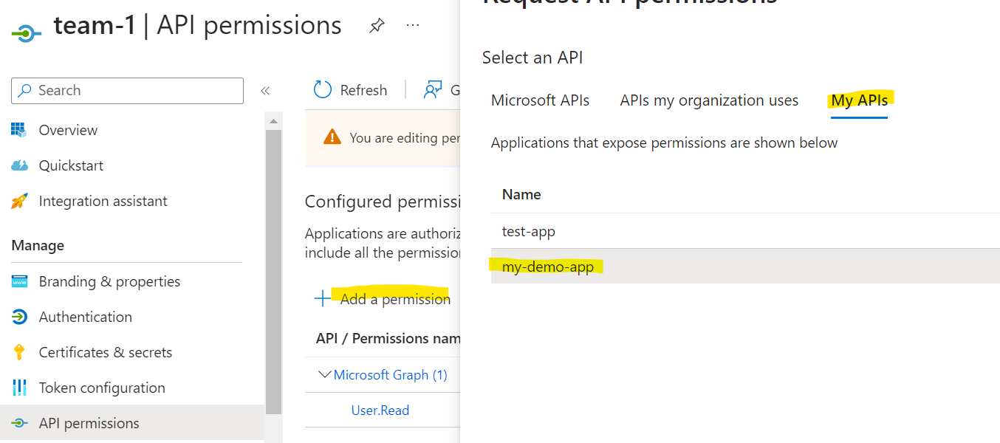
 

1. Add the **team1** app role 
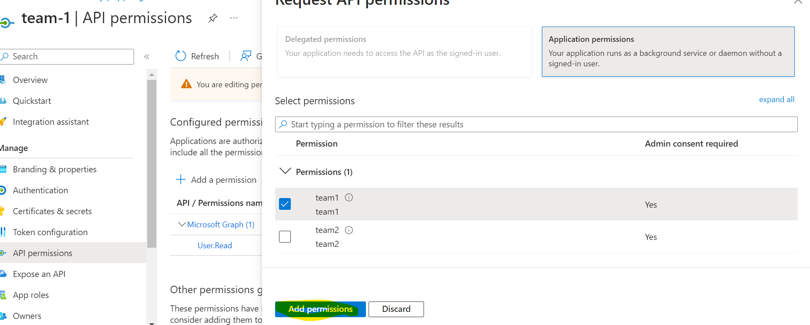
 

1. Grant admin consent - this consents to the configuration made to the application
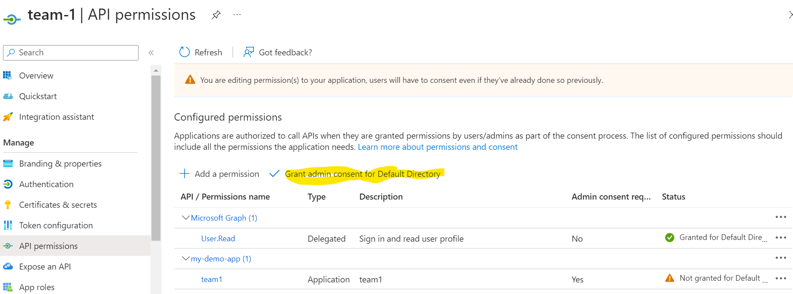

 
We'll then do the same to our **team-2** app. 

**Now to test it!**

So we'll need to retrieve a token by making a POST request to the OAuth V2 endpoint, but using our **team-1** and **team-2** credentials.

1. Head over to the my-demo-app overview, select endpoints and copy the V2 token endpoint:
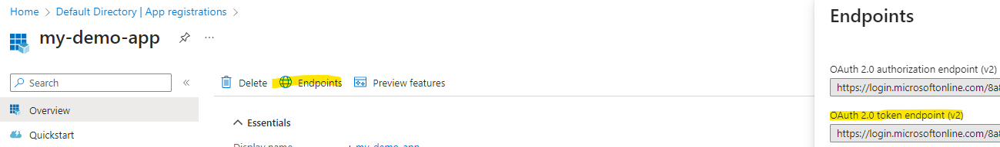
 

1. We need the scope, as we'll be using the `grant_type: client_credentials`, we'll use the ./default scope so using the client id of **my-demo-app** we can define populate the scope, `scope: api://<client-id>/.default`. 
To see more on scopes with Azure AD check out [this blog here](https://dev.to/425show/just-what-is-the-default-scope-in-the-microsoft-identity-platform-azure-ad-2o4d).
 

1. Now we just need the client_id and secret for our team apps, so take a note of the credentials for `team-1` and `team-2`

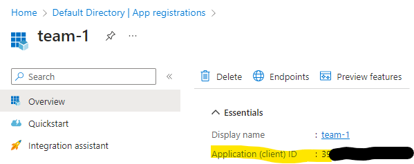

  

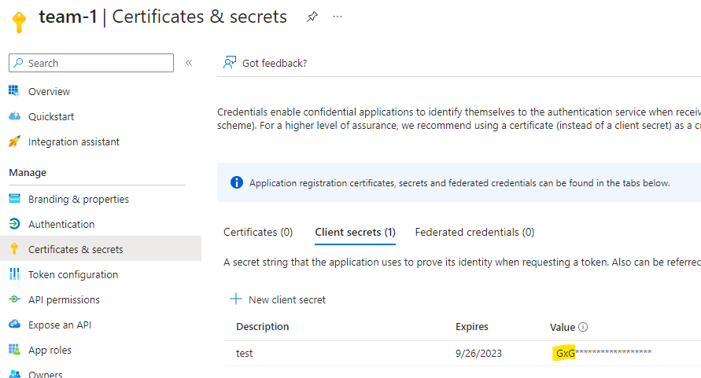

**Finally** - Lets make a POST request - I'm going to use postman here, and the credentials from my team-1 app:

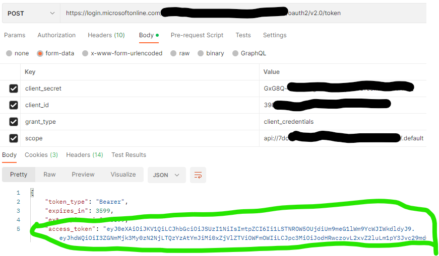

Hey presto! 
We have our token - if we head over to [jwt.io](https://jwt.io/) to decode our bearer token:

Note the role - **team1** (We'd also get the **team2**, role using my **team-2** app credentials instead).

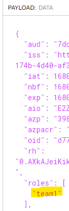

### That was fun - but I need a quick break.. 

[Once you've grabbed your coffee, feel free to continue here...](./opa-envoy-pt2.md)
