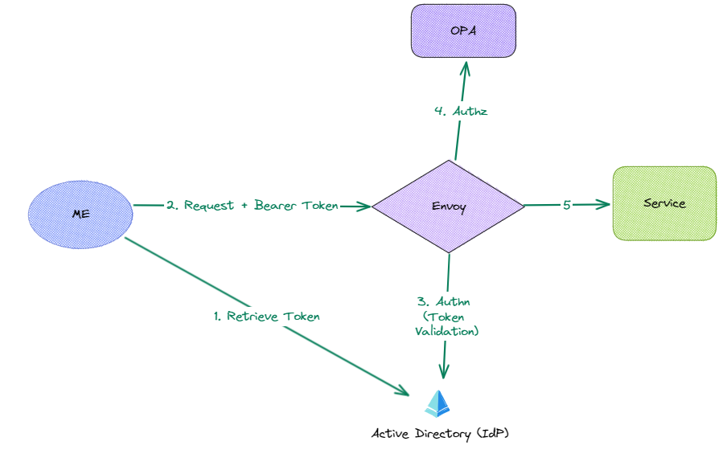

# Authn & Authz using OPA & Envoy 

## Introduction

So I recently played with OPA & Envoy in-order to address authentication (Authn) and authorization (Authz).
We'll look to quickly walk through the setup, and to accompany this post there is an example [opa-envoy repo found here](https://github.com/podedra92/opa-envoy).

There will be other approaches to this - so further posts will also probably follow.

### Authn & Authz

**Authn** verifies the identity of a user or system, I am who I say I am, a couple of examples of these are credential based (username and password) or certificate based etc.

**Authz** determines whether a user or a system is authorized to access a resource or perform an action.
This involves evaluating the permissions/entitlements granted to the user or the system, against a set of policies specifying what is allowed or denied.

### Why are we doing this?

We could embed this within our application, but we want to decouple the security concerns from business logic.
SoC (separation of concerns) which leads to easier updates and testing, in addition we want our Policies to be centrally managed, whilst still allowing teams to write their own policies.

### OPA

Open Policy Agent (OPA) if you aren't already aware a CNCF graduate, having been accepted in 2018.
Its open source and a versatile policy engine, providing a central, unified method of enforcing policies.

Rego is the declarative language used for defining fine-grained policies, its meant to be easy to read and write (perfect for me!).
The policies, once authored and tested, are consumed by OPA and used for evaluation.

### Envoy

Envoy is a proxy operating at L7 level, its the backbone for most service meshes, and fortunately for us supports External filters, such as an external authorization filter, this allows for delegation of decisions such as authorization to an external service.

This is where OPA and Envoy can be used in conjunction, OPA-Envoy plugin extends OPA with a gRPC server which implements Envoys External authz api (authorization filter).

## Implement

Lets have a look at what we're creating:

The first step is I'll use credentials to retrieve a token from Azure AD (Active Directory), this token will then be passed in the header of my request to the api.
Envoy will first use Authn filter to validate the JWT, invalid or no JWT will lead to a 401.  
Once the Authn filter passes, Envoy will then initiate the Authz filter.
This is where OPA, the authorization service, will validate the role within the token against the policies defined and determine whether the action should be permitted or denied.
Envoy then forwards the request to the service or returns a 403 (forbidden).

### Active Directory

**Note:** You may also carry out these steps within Azure AD B2C.

1. Create an app registration

### Fast API

### OPA

### Envoy

### How to run

https://www.ipannila.net/authorization-with-opa/
https://www.ipannila.net/dotnet-authn-and-envoy/
https://www.ipannila.net/azure-ad-b2c-app-registration/
